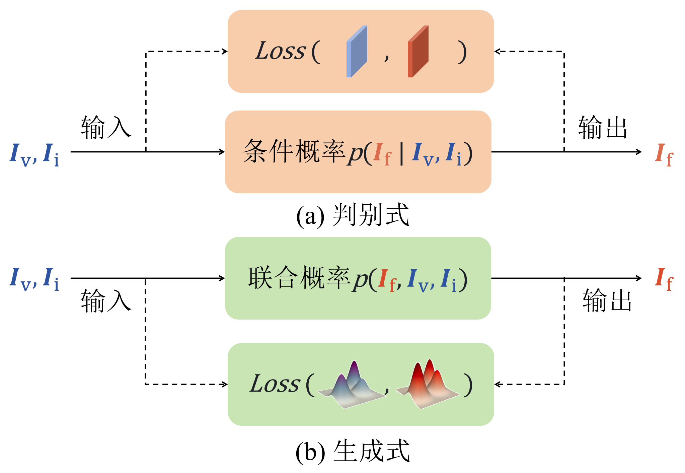
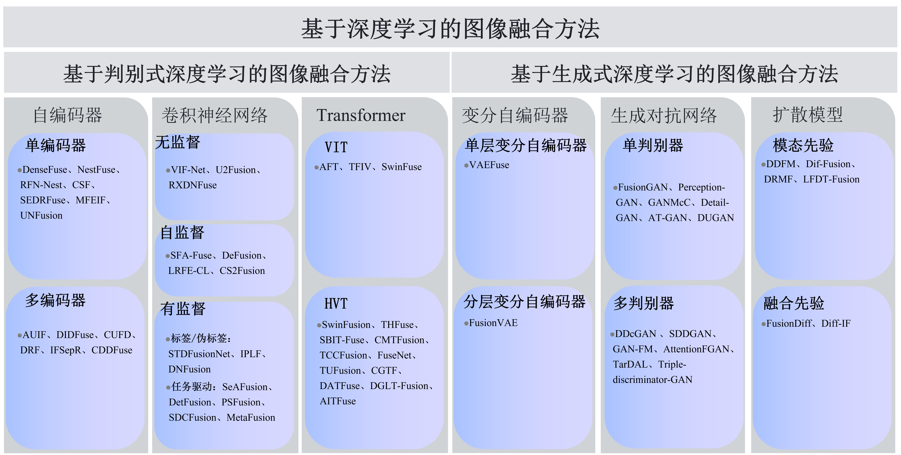

# 双光载荷图像融合及其在低空遥感中的应用
<!-- <a href="https://github.com/sunbinuestc/VIF-in-LARS/blob/main/README_eng_ver.md">English Version</a> -->
## 摘要
双光载荷图像融合在目标监测、灾情预警及专业巡检等低空遥感领域有着广泛的应用前景。首先针对应用场景，统计并归纳了任务载荷双光图像数据集，为相关研究及应用提供数据支持。其次，跟踪深度学习领域的最新技术，系统总结基于深度学习的双光载荷图像融合方法，将现有方法归纳为生成式和判别式两类，并详细梳理代表性的方法及特点。再次，从定性分析、融合质量及运行效率三个方面，对不同类型的图像融合方法在不同数据集上的融合效果进行深入的实验对比分析。最后，探讨图像融合技术在低空遥感应用中面临的挑战问题，为相关领域的研究提供参考。
## 低空遥感双光图像数据集
表1统计了以低空飞行器为平台，搭载双光载荷的各类应用场景数据集，包括但不限于目标监测、灾情预警、专业巡检等。其中所有数据集均包含可见光和灰度/伪彩色红外图像对或视频对，配准后的双光图像对可支持像素级图像融合方法的研究和验证。

**目标监测**：低空飞行器在执行目标监测任务时，常常面临恶劣天气、光照变化等挑战性问题。红外与可见光图像融合可以为警务及管理人员提供可视化的融合结果，清晰呈现场景及重点目标信息，用于交通、安检等昼夜监测，提升监测系统的实用性和效率。

**灾情预警**：在应对各种灾情时，低空飞行器是不可或缺的遥感平台。尤其在火灾中由于烟雾密集导致视觉受限严重，结合可见光与红外图像融合技术，能够同步且清晰地呈现火点区域及其周边环境细节，为救援人员了解及研判火情提供重要依据。

**专业巡检**：低空飞行器搭载双光载荷，能够提供巡检目标空中视角的双光图像。结合图像融合技术为专业巡检人员提供巡检场景及关键热辐射区域的可视化效果，可以对高层建筑立面、屋顶及热桥等特定区域实施能源审计；对桥梁、路面、堤坝等基础设施进行无损检测；以及对电力线、绝缘子以及核设施等高危设备进行巡检，辅助专业人员发现安全隐患并定位故障，提升巡检效率。

表1 低空遥感双光图像数据集

<table align=center>
  <tr>
    <th>应用场景</th>
    <th>数据集</th>
    <th>年份</th>
    <th>机构</th>
    <th>图像/视频对</th>
    <th>分辨率</th>
    <th>图像类型</th>
    <th>配准</th>
  </tr>
  <tr>
    <td rowspan="11">目标监测</td>
    <td><a href="https://zhang-pengyu.github.io/DUT-VTUAV/#Download">VTUAV</a></td>
    <td>2022</td>
    <td>大连理工大学</td>
    <td>500</td>
    <td>1920×1080</td>
    <td>1</td>
    <td>是</td>
  </tr>
  <tr>
    <td><a href="https://github.com/VisDrone/DroneVehicle">DroneVehicle</a></td>
    <td>2022</td>
    <td>天津大学</td>
    <td>28,439</td>
    <td>640×512</td>
    <td>1</td>
    <td>是</td>
  </tr>
  <tr>
    <td><a href="https://www.nii-cu-multispectral.org/">NII-CU</a></td>
    <td>2022</td>
    <td>日本国立情报研究所</td>
    <td>5,880</td>
    <td>3840×2160, 640×512</td>
    <td>1</td>
    <td>是</td>
  </tr>
  <tr>
    <td><a href="https://sites.google.com/uw.edu/wisard">WiSARD</a></td>
    <td>2022</td>
    <td>华盛顿大学</td>
    <td>15,453</td>
    <td>512×512</td>
    <td>1</td>
    <td>否</td>
  </tr>
  <tr>
    <td><a href="https://zenodo.org/records/7465521#.Y6Jk0XbMJD8">RGB-LWIR Labeled Dataset</a></td>
    <td>2022</td>
    <td>乔治梅森大学</td>
    <td>12,600</td>
    <td>1128×896</td>
    <td>2</td>
    <td>是</td>
  </tr>
  <tr>
    <td><a href="https://github.com/ahucslf/UAV-VIIR">UAV-VIIR</a></td>
    <td>2023</td>
    <td>安徽大学</td>
    <td>5,560</td>
    <td>/</td>
    <td>2</td>
    <td>否</td>
  </tr>
  <tr>
    <td><a href="https://github.com/fengh96/RTDOD">RTDOD</a></td>
    <td>2023</td>
    <td>中国科学院大学</td>
    <td>16,200</td>
    <td>1280×720</td>
    <td>1</td>
    <td>否</td>
  </tr>
  <tr>
    <td><a href="https://github.com/wgw123wqw/PFTrack/blob/main/videos/VTMOT.mp4">VT-MOT</a></td>
    <td>2024</td>
    <td>安徽大学</td>
    <td>582</td>
    <td>640×480, 1600×1200</td>
    <td>视频对</td>
    <td>否</td>
  </tr>
  <tr>
    <td><a href="https://github.com/XingLongh/GTM-Fuse">HBUT-IV</a></td>
    <td>2024</td>
    <td>湖北工业大学</td>
    <td>50</td>
    <td>800×600等</td>
    <td>1</td>
    <td>是</td>
  </tr>
  <tr>
    <td><a href="https://github.com/mmic-lab/Datasets-and-benchmark-code/tree/main">HIAL</a></td>
    <td>2024</td>
    <td>安徽大学</td>
    <td>150</td>
    <td>1920×1080</td>
    <td>视频对</td>
    <td>是</td>
  </tr>
  <tr>
    <td><a href="https://github.com/VDT-2048/DV-TOD#tab-readme-ov-file">DV-TOD</a></td>
    <td>2024</td>
    <td>东北大学</td>
    <td>2,179</td>
    <td>1920×1080, 640×512</td>
    <td>2</td>
    <td>否</td>
  </tr>
  <tr>
    <td rowspan="5">灾情预警</td>
    <td><a href="https://ieee-dataport.org/open-access/flame-dataset-aerial-imagery-pile-burn-detection-using-drones-uavs">FLAME</a></td>
    <td>2021</td>
    <td>北亚利桑那大学</td>
    <td>4万帧以上视频</td>
    <td>640×512等</td>
    <td>2</td>
    <td>否</td>
  </tr>
  <tr>
    <td><a href="https://www.mdpi.com/2072-4292/15/12/3173">forest fire</a></td>
    <td>2023</td>
    <td>北京林业大学</td>
    <td>6,972</td>
    <td>512×512</td>
    <td>1</td>
    <td>是</td>
  </tr>
  <tr>
    <td>石坝管涌灾害</td>
    <td>2023</td>
    <td>中国应急管理部</td>
    <td>/</td>
    <td>640×512</td>
    <td>2</td>
    <td>是</td>
  </tr>
  <tr>
    <td><a href="http://complex.ustc.edu.cn/main.htm">RGBT Wildfire</a></td>
    <td>2023</td>
    <td>中国科学技术大学</td>
    <td>1,367</td>
    <td>420×420, 640×512</td>
    <td>1</td>
    <td>否</td>
  </tr>
  <tr>
    <td><a href="https://zenodo.org/records/12773422">FireMan</a></td>
    <td>2024</td>
    <td>奥卢大学</td>
    <td>1,470</td>
    <td>958×760</td>
    <td>2</td>
    <td>是</td>
  </tr>
  <tr>
    <td rowspan="10">专业巡检</td>
    <td><a href="https://datasetsearch.research.google.com/search?src=0&query=powerline%20infrared%20visible&docid=12cvMTFsaj-Jian1LZA%3Dp3D">Powerline Image</a></td>
    <td>2017</td>
    <td>阿纳多卢大学</td>
    <td>4,000</td>
    <td>128×128</td>
    <td>1</td>
    <td>否</td>
  </tr>
  <tr>
    <td><a href="https://doi.org/10.5281/zenodo.5241286">BOOSS</a></td>
    <td>2021</td>
    <td>南加州大学</td>
    <td>5,193</td>
    <td>512×512</td>
    <td>1</td>
    <td>是</td>
  </tr>
  <tr>
    <td><a href="https://zenodo.org/records/7360996">TBBR</a></td>
    <td>2022</td>
    <td>卡尔斯鲁厄理工学院</td>
    <td>2,848</td>
    <td>4000×3000, 640×512</td>
    <td>1</td>
    <td>否</td>
  </tr>
  <tr>
    <td><a href="https://github.com/parham/lemanchot-analysis">lemanchot-analysis</a></td>
    <td>2022</td>
    <td>拉瓦尔大学</td>
    <td>273</td>
    <td>640×480</td>
    <td>2</td>
    <td>是</td>
  </tr>
  <tr>
    <td><a href="https://github.com/hhuijiang/DSG-BINet">RGB-T TL</a></td>
    <td>2022</td>
    <td>河海大学</td>
    <td>600</td>
    <td>1920×1080, 640×480</td>
    <td>2</td>
    <td>否</td>
  </tr>
  <tr>
    <td>CVpower</td>
    <td>2022</td>
    <td>上海电力大学</td>
    <td>240</td>
    <td>240×320</td>
    <td>2</td>
    <td>否</td>
  </tr>
  <tr>
    <td>VITLD</td>
    <td>2022</td>
    <td>浦项科技大学</td>
    <td>400</td>
    <td>256×256</td>
    <td>1</td>
    <td>是</td>
  </tr>
  <tr>
    <td>BIM</td>
    <td>2023</td>
    <td>奥克兰大学</td>
    <td>34</td>
    <td>/</td>
    <td>1</td>
    <td>是</td>
  </tr>
  <tr>
    <td>Facade deterioration dataset</td>
    <td>2024</td>
    <td>同济大学</td>
    <td>1,228</td>
    <td>800×600</td>
    <td>2</td>
    <td>是</td>
  </tr>
</table>                                                       
注：图像类型1表示可见光和灰度红外图像，2表示可见光和伪彩色红外图像。表格中无链接数据集均要求按需申请

## 基于深度学习的图像融合方法分类
本文聚焦可见光和红外图像融合算法在低空遥感场景下的应用，依据网络架构和建模方式对深度学习方法进行分类，所采用的分类方式可以推广至其它类型的图像融合方法。随着深度学习在视觉任务中的突破性进展，以深度学习为基础的图像融合方法逐渐成为关注的热点。根据数据分布的不同建模方式，基于深度学习的图像融合方法可以分为判别式与生成式两大类。

图1 判别式和生成式深度学习图像融合方法示意图

判别式方法使用参数化的网络模型对条件概率分布进行建模，通过在特征间构建损失函数学习从多个输入到单个输出的映射关系，从而预测融合结果。这类方法训练过程直接且高效，适用于处理数据分布较为复杂的情况，但不具备生成新数据的能力。

生成式方法显式或隐式地学习数据的联合概率分布，通过在分布间构建损失函数建立输入和输出之间的关系生成新的融合结果。这类方法可以捕捉数据的分布规律具备生成能力，能够应对模态缺失的融合问题。但是计算过程较为复杂耗时。

图2 基于深度学习的图像融合方法分类

表2 判别式深度学习图像融合方法对比

<table align=center>
  <tr>
    <th>判别式融合</th>
    <th>特征表示</th>
    <th>融合策略</th>
    <th>监督方式</th>
    <th>训练方式</th>
    <th>复杂度</th>
    <th>效率</th>
  </tr>
  <tr>
    <td>自编码器</td>
    <td>特征降维</td>
    <td>人工为主</td>
    <td>自监督</td>
    <td>非端到端为主</td>
    <td>低</td>
    <td>高</td>
  </tr>
  <tr>
    <td>卷积神经网络</td>
    <td>局部特征</td>
    <td>人工/学习</td>
    <td>无监督/自监督/有监督</td>
    <td>非端到端/端到端</td>
    <td>中</td>
    <td>中</td>
  </tr>
  <tr>
    <td>Transformer</td>
    <td>全局特征</td>
    <td>人工/学习</td>
    <td>无监督/自监督/有监督</td>
    <td>非端到端/端到端</td>
    <td>高</td>
    <td>低</td>
  </tr>
</table>

表3 生成式深度学习图像融合方法对比

<table align=center>
  <tr>
    <th>生成式融合</th>
    <th>生成原理</th>
    <th>估计方式</th>
    <th>融合策略</th>
    <th>生成质量</th>
    <th>训练方式</th>
    <th>复杂度</th>
    <th>训练稳定性</th>
    <th>效率</th>
  </tr>
  <tr>
    <td>变分自编码器</td>
    <td>变分推理</td>
    <td>显示</td>
    <td>学习</td>
    <td>低</td>
    <td>端到端</td>
    <td>高</td>
    <td>稳定</td>
    <td>高</td>
  </tr>
  <tr>
    <td>生成对抗网络</td>
    <td>对抗训练</td>
    <td>隐式</td>
    <td>学习</td>
    <td>高</td>
    <td>端到端</td>
    <td>中</td>
    <td>不稳定</td>
    <td>中</td>
  </tr>
  <tr>
    <td>扩散模型</td>
    <td>随机过程</td>
    <td>隐式</td>
    <td>人工/学习</td>
    <td>高</td>
    <td>端到端/非端到端</td>
    <td>低</td>
    <td>较稳定</td>
    <td>低</td>
  </tr>
</table>

## 基于深度学习的图像融合实验对比

实验部分选择12种代表性图像融合算法从定性、融合质量以及运行效率三方面全面评估算法的性能。其中基于自编码器（AE）子类，选择[DenseFuse](https://github.com/hli1221/imagefusion_densefuse)和[DIDFuse](https://github.com/Zhaozixiang1228/IVIF-DIDFuse)分别对应单编码器和多编码器的融合方法，融合策略均选择在原文中表现优异的加法融合；基于卷积神经网络（CNN）子类，选择[U2Fusion](https://github.com/hanna-xu/U2Fusion)、[STDFusionNet](https://github.com/Linfeng-Tang/STDFusionNet)、[SeAFusion](https://github.com/Linfeng-Tang/SeAFusion)和[DeFusion](https://github.com/erfect2020/DecompositionForFusion)分别对应无监督、手工标注、任务驱动和自监督的方法；基于Transformer子类，选择[SwinFusion](https://github.com/Linfeng-Tang/SwinFusion)和[SwinFuse](https://github.com/Zhishe-Wang/SwinFuse)分别对应ViT和HVT的方法；基于生成对抗网络（GAN）的子类，选择[FusionGAN](https://github.com/jiayi-ma/FusionGAN)和[GANFM](https://github.com/Linfeng-Tang/VIF-Benchmark/blob/49b70707e6320f24bb288b9ab7db1ecf7d0d119c/GAN-FM/README.md?plain=1)分别对应单判别器和多判别器的方法；基于扩散模型（Diffusion）的子类，选择[Diff-IF](https://github.com/XunpengYi/Diff-IF)和[DDFM](https://github.com/cosimoizzo/DDFM)分别对应以融合图像为先验和以模态图像为先验的方法。需要说明的是，由于基于变分自编码器（VAE）的图像融合方法较少且未公开预训练模型，因此对比实验中未包含该类别的算法。

用于验证方法的测试集选择VTUAV、Fireman、BOOSS数据集，对应目标监测、灾情预警和专业巡检三类场景，图像尺寸分别为640×360，640×512和512×512。实验中从这些数据集中各随机选取50对图像进行定量评估。所有的源图像在空间上严格对齐。Fireman数据集中伪彩色红外图像，先经过YCbCr转换保留Y通道，这一操作不影响红外图像中的强度信息。所有可见光图像在融合前转换到YCbCr颜色空间，保留Y通道红外图像进行融合，融合后通过逆变换转为RGB融合结果。

表4 融合图像定量比较结果

<table align=center>
  <tr>
    <th>数据集</th>
    <th>方法</th>
    <th>类型</th>
    <th>AG↑</th>
    <th>Qabf↑</th>
    <th>SD↑</th>
    <th>VIF↑</th>
  </tr>
  
  <!-- BOOSS数据集 -->
  <tr>
    <td rowspan="12"><b>BOOSS</b></td>
    <td>DenseFuse</td>
    <td>AE</td>
    <td>4.659</td>
    <td>0.812</td>
    <td>38.829</td>
    <td><ins>1.175</ins></td>
  </tr>
  <tr>
    <td>DIDFuse</td>
    <td>AE</td>
    <td>4.611</td>
    <td>0.736</td>
    <td><ins>45.147</ins></td>
    <td>1.120</td>
  </tr>
  <tr>
    <td>U2Fusion</td>
    <td>CNN</td>
    <td>5.094</td>
    <td>0.753</td>
    <td>39.413</td>
    <td>1.070</td>
  </tr>
  <tr>
    <td>DeFusion</td>
    <td>CNN</td>
    <td>3.190</td>
    <td>0.315</td>
    <td>23.517</td>
    <td>0.904</td>
  </tr>
  <tr>
    <td>STDFusionNet</td>
    <td>CNN</td>
    <td><ins>5.122</ins></td>
    <td>0.821</td>
    <td>44.402</td>
    <td>1.169</td>
  </tr>
  <tr>
    <td>SeAFusion</td>
    <td>CNN</td>
    <td>4.900</td>
    <td>0.723</td>
    <td>37.887</td>
    <td>1.012</td>
  </tr>
  <tr>
    <td>SwinFuse</td>
    <td>Transformer</td>
    <td>5.094</td>
    <td><b>0.825</b></td>
    <td><b>49.793</b></td>
    <td><b>1.269</b></td>
  </tr>
  <tr>
    <td>SwinFusion</td>
    <td>Transformer</td>
    <td>5.016</td>
    <td><ins>0.822</ins></td>
    <td>39.204</td>
    <td>1.111</td>
  </tr>
  <tr>
    <td>FusionGAN</td>
    <td>GAN</td>
    <td>3.462</td>
    <td>0.220</td>
    <td>19.378</td>
    <td>0.865</td>
  </tr>
  <tr>
    <td>GAN-FM</td>
    <td>GAN</td>
    <td><b>5.517</b></td>
    <td>0.669</td>
    <td>40.298</td>
    <td>1.083</td>
  </tr>
  <tr>
    <td>Diff-IF</td>
    <td>Diffusion</td>
    <td>4.621</td>
    <td>0.646</td>
    <td>36.001</td>
    <td>1.002</td>
  </tr>
  <tr>
    <td>DDFM</td>
    <td>Diffusion</td>
    <td>2.802</td>
    <td>0.210</td>
    <td>34.911</td>
    <td>1.100</td>
  </tr>

  <!-- Fireman数据集 -->
  <tr>
    <td rowspan="12"><b>Fireman</b></td>
    <td>DenseFuse</td>
    <td>AE</td>
    <td>2.597</td>
    <td><b>0.692</b></td>
    <td>39.923</td>
    <td>1.089</td>
  </tr>
  <tr>
    <td>DIDFuse</td>
    <td>AE</td>
    <td>2.543</td>
    <td>0.559</td>
    <td><ins>50.556</ins></td>
    <td>0.991</td>
  </tr>
  <tr>
    <td><ins>U2Fusion</ins></td>
    <td>CNN</td>
    <td><ins>3.078</ins></td>
    <td><ins>0.691</ins></td>
    <td>40.714</td>
    <td>0.932</td>
  </tr>
  <tr>
    <td>DeFusion</td>
    <td>CNN</td>
    <td>2.271</td>
    <td>0.431</td>
    <td>33.644</td>
    <td>0.847</td>
  </tr>
  <tr>
    <td>STDFusionNet</td>
    <td>CNN</td>
    <td>2.329</td>
    <td>0.405</td>
    <td>45.883</td>
    <td><b>1.142</b></td>
  </tr>
  <tr>
    <td>SeAFusion</td>
    <td>CNN</td>
    <td><b>3.082</b></td>
    <td>0.647</td>
    <td>46.375</td>
    <td>1.005</td>
  </tr>
  <tr>
    <td>SwinFuse</td>
    <td>Transformer</td>
    <td>2.647</td>
    <td>0.626</td>
    <td><b>51.177</b></td>
    <td><ins>1.119</ins></td>
  </tr>
  <tr>
    <td>SwinFusion</td>
    <td>Transformer</td>
    <td>2.609</td>
    <td>0.493</td>
    <td>43.848</td>
    <td>1.046</td>
  </tr>
  <tr>
    <td>FusionGAN</td>
    <td>GAN</td>
    <td>2.005</td>
    <td>0.126</td>
    <td>28.352</td>
    <td>0.788</td>
  </tr>
  <tr>
    <td>GAN-FM</td>
    <td>GAN</td>
    <td>2.933</td>
    <td>0.536</td>
    <td>45.981</td>
    <td>1.060</td>
  </tr>
  <tr>
    <td>Diff-IF</td>
    <td>Diffusion</td>
    <td>2.688</td>
    <td>0.533</td>
    <td>43.600</td>
    <td>0.989</td>
  </tr>
  <tr>
    <td>DDFM</td>
    <td>Diffusion</td>
    <td>2.247</td>
    <td>0.280</td>
    <td>39.225</td>
    <td>1.033</td>
  </tr>

  <!-- VTUAV数据集 -->
  <tr>
    <td rowspan="12"><b>VTUAV</b></td>
    <td>DenseFuse</td>
    <td>AE</td>
    <td>3.149</td>
    <td>0.476</td>
    <td>40.572</td>
    <td>0.681</td>
  </tr>
  <tr>
    <td>DIDFuse</td>
    <td>AE</td>
    <td>3.478</td>
    <td>0.438</td>
    <td><ins>57.225</ins></td>
    <td>0.663</td>
  </tr>
  <tr>
    <td>U2Fusion</td>
    <td>CNN</td>
    <td><b>3.838</b></td>
    <td><ins>0.537</ins></td>
    <td>42.224</td>
    <td>0.661</td>
  </tr>
  <tr>
    <td>DeFusion</td>
    <td>CNN</td>
    <td>2.955</td>
    <td>0.396</td>
    <td><u>39.211</u></td>
    <td>0.677</td>
  </tr>
  <tr>
    <td>STDFusionNet</td>
    <td>CNN</td>
    <td>3.542</td>
    <td>0.496</td>
    <td>50.262</td>
    <td>0.764</td>
  </tr>
  <tr>
    <td><u>SeAFusion</u></td>
    <td>CNN</td>
    <td><ins>3.756</ins></td>
    <td>0.532</td>
    <td>48.173</td>
    <td><u>0.762</u></td>
  </tr>
  <tr>
    <td>SwinFuse</td>
    <td>Transformer</td>
    <td>3.401</td>
    <td>0.436</td>
    <td><b>61.139</b></td>
    <td>0.685</td>
  </tr>
  <tr>
    <td>SwinFusion</td>
    <td>Transformer</td>
    <td>3.675</td>
    <td><b>0.546</b></td>
    <td>47.659</td>
    <td>0.748</td>
  </tr>
  <tr>
    <td>FusionGAN</td>
    <td>GAN</td>
    <td>2.891</td>
    <td>0.272</td>
    <td>33.117</td>
    <td>0.509</td>
  </tr>
  <tr>
    <td>GAN-FM</td>
    <td>GAN</td>
    <td>3.685</td>
    <td>0.464</td>
    <td>51.469</td>
    <td><b>0.823</b></td>
  </tr>
  <tr>
    <td><u>Diff-IF</u></td>
    <td>Diffusion</td>
    <td>3.734</td>
    <td>0.507</td>
    <td>46.214</td>
    <td><ins>0.811</ins></td>
  </tr>
  <tr>
    <td>DDFM</td>
    <td>Diffusion</td>
    <td>2.531</td>
    <td>0.119</td>
    <td>40.168</td>
    <td>0.188</td>
  </tr>
</table>
注：<b>加粗</b>表示最优结果，<ins>下划线</ins>表示次优结果

表5 融合效率分析表

<table align=center>
  <tr>
    <th>方法</th>
    <th>参数量/10⁶</th>
    <th>运行时间/VTUAV</th>
    <th>运行时间/BOOSS</th>
    <th>运行时间/Fireman</th>
  </tr>
  <tr>
    <td>DenseFuse</td>
    <td>0.2226</td>
    <td>0.1981±0.0219</td>
    <td>0.2087±0.0228</td>
    <td>0.2068±0.0224</td>
  </tr>
  <tr>
    <td>DIDFuse</td>
    <td>0.2609</td>
    <td>0.0706±0.0020</td>
    <td>0.0784±0.0032</td>
    <td>0.0919±0.0031</td>
  </tr>
  <tr>
    <td>U2Fusion</td>
    <td>0.6592</td>
    <td>0.0514±0.0028</td>
    <td>0.0592±0.0032</td>
    <td>0.0737±0.0035</td>
  </tr>
  <tr>
    <td>DeFusion</td>
    <td>7.8745</td>
    <td>0.3298±0.0224</td>
    <td>0.4311±0.0281</td>
    <td>0.4008±0.0591</td>
  </tr>
  <tr>
    <td>STDFusion-Net</td>
    <td>0.2825</td>
    <td><ins>0.0351±0.0011</ins></td>
    <td><ins>0.0395±0.0014</ins></td>
    <td><ins>0.0492±0.0015</ins></td>
  </tr>
  <tr>
    <td>SeAFusion</td>
    <td>0.1669</td>
    <td><strong>0.0028±0.0001</strong></td>
    <td><strong>0.0030±0.0004</strong></td>
    <td><strong>0.0036±0.0003</strong></td>
  </tr>
  <tr>
    <td>SwinFuse</td>
    <td>2.0212</td>
    <td>0.3081±0.0336</td>
    <td>0.4059±0.0068</td>
    <td>0.5405±0.0557</td>
  </tr>
  <tr>
    <td>SwinFusion</td>
    <td>0.9737</td>
    <td>1.8497±0.0778</td>
    <td>2.0115±0.0625</td>
    <td>2.7393±0.1065</td>
  </tr>
  <tr>
    <td>FusionGAN</td>
    <td>1.3264</td>
    <td>0.0528±0.0049</td>
    <td>0.0616±0.0055</td>
    <td>0.0773±0.0052</td>
  </tr>
  <tr>
    <td>GAN-FM</td>
    <td>15.0754</td>
    <td>0.5588±0.0356</td>
    <td>0.5370±0.0307</td>
    <td>0.5736±0.0341</td>
  </tr>
  <tr>
    <td>Diff-IF</td>
    <td>23.713</td>
    <td>1.2199±0.0045</td>
    <td>1.3794±0.0057</td>
    <td>1.7217±0.0088</td>
  </tr>
  <tr>
    <td>DDFM</td>
    <td>552.663</td>
    <td>18.8247±0.5315</td>
    <td>22.5692±0.5867</td>
    <td>29.3542±0.3868</td>
  </tr>
</table>

注：<strong>加粗</strong>表示最优结果，<ins>下划线</ins>表示次优结果

## 结语
尽管基于深度学习的可见光和红外图像融合方法取得了一系列成果，但在低空遥感实际应用中仍需要突破在各种非理想条件下的技术难点：1）未精确配准的图像融合；2）干扰环境下的图像融合；3）运动模糊下的图像融合。

基于深度学习的可见光和红外图像融合具有巨大的应用潜力，以下未来研究方向将进一步推动图像融合方法的探索，并加速其在低空遥感场景中的落地应用：1）高效实时的图像融合；2）统一全面的客观评价；3）任务协同的图像融合。
## 指标筛选方法
见[metric calculation](https://github.com/sunbinuestc/VIF-metrics-analysis/tree/fec9d88fe85de35246e82eb0d4dc95c535b9d0f4/code/Python/metric%20calculation)

## 引用
孙彬, 游航, 李文博, 刘祥瑞, 马佳义. 双光载荷图像融合及其在低空遥感中的应用[J]. 航空学报, 2025, 46(11): 531343.

Bin SUN, Hang YOU, Wenbo LI, Xiangrui LIU, Jiayi MA. Dual-band payload image fusion and its applications in low-altitude remote sensing[J]. Acta Aeronautica et Astronautica Sinica, 2025, 46(11): 531343.

中国知网链接：https://kns.cnki.net/kcms/Detail/Detail.aspx?doi=11.1929.V.20241227.1548.002

航空学报官方链接：https://hkxb.buaa.edu.cn/CN/10.7527/S1000-6893.2024.31343

在项目中，我们引用了一些网络中开源的客观指标计算代码，在此感谢提供这些代码的开发者！
